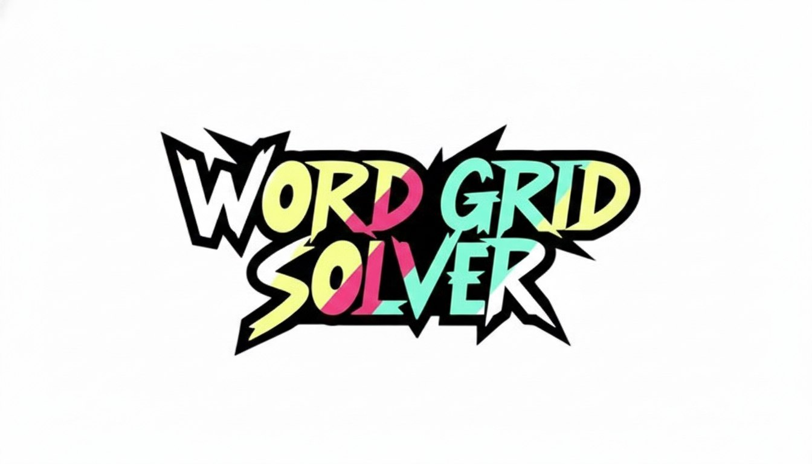

<div id="top">

<!-- HEADER STYLE: MODERN -->
<div align="left" style="position: relative; width: 100%; height: 100%; ">



# <code>❯ Word Grid Solver</code>

<em>Decode puzzles instantly, unleash hidden words<em>

<!-- BADGES -->
<!-- local repository, no metadata badges. -->

<em>Built with the tools and technologies:</em>


</div>
</div>
<br clear="right">

---

## Table of Contents

I. [Table of Contents](#table-of-contents)<br>
II. [Overview](#overview)<br>
III. [Features](#features)<br>
IV. [Project Structure](#project-structure)<br>
&nbsp;&nbsp;&nbsp;&nbsp;IV.a. [Project Index](#project-index)<br>
V. [Getting Started](#getting-started)<br>
&nbsp;&nbsp;&nbsp;&nbsp;V.a. [Prerequisites](#prerequisites)<br>
&nbsp;&nbsp;&nbsp;&nbsp;V.b. [Installation](#installation)<br>
&nbsp;&nbsp;&nbsp;&nbsp;V.c. [Usage](#usage)<br>
VI. [Contributing](#contributing)<br>
VII. [License](#license)<br>


---

## Overview

---

## Features

|      | Component       | Details |
| :--- | :-------------- | :------- |
| ⚙️  | **Architecture** | <ul><li>Simple **Flask** web service (single‑module entry point)</li><li>Static word list (`words_alpha.txt`) loaded at runtime</li><li>Docker‑based deployment (Dockerfile builds a Python 3 image)</li></ul> |
| 🔩 | **Code Quality** | <ul><li>Dependencies pinned in `requirements.txt` → reproducible builds</li><li>No explicit linting or type‑checking configuration (e.g., no `flake8`, `mypy`)</li><li>Minimal inline documentation; function names are self‑descriptive</li></ul> |
| 📄 | **Documentation** | <ul><li>`Dockerfile` provided – shows build steps and entrypoint</li><li>Missing high‑level README/usage guide</li><li>`requirements.txt` serves as informal API surface list</li></ul> |
| 🔌 | **Integrations** | <ul><li>**Flask** – HTTP routing & request handling</li><li>**Requests** – outbound HTTP calls (if any)</li><li>**Werkzeug** – underlying WSGI utilities (used by Flask)</li></ul> |
| 🧩 | **Modularity** | <ul><li>All logic currently in a single Python module (low modularity)</li><li>Static data (`words_alpha.txt`) kept separate for easy replacement</li></ul> |
| 🧪 | **Testing** | <ul><li>No test suite detected (no `tests/` folder, no `pytest`/`unittest` config)</li><li>CI pipeline only builds Docker image, no test execution</li></ul> |

---

## Project Structure

```sh
└── /
    ├── app.py
    ├── Dockerfile
    ├── requirements.txt
    ├── solver.py
    ├── static
    │   ├── script.js
    │   └── style.css
    ├── templates
    │   └── index.html
    └── words_alpha.txt
```

### Project Index

<details open>
	<summary><b><code>/</code></b></summary>
	<!-- __root__ Submodule -->
	<details>
		<summary><b>__root__</b></summary>
		<blockquote>
			<div class='directory-path' style='padding: 8px 0; color: #666;'>
				<code><b>⦿ __root__</b></code>
			<table style='width: 100%; border-collapse: collapse;'>
			<thead>
				<tr style='background-color: #f8f9fa;'>
					<th style='width: 30%; text-align: left; padding: 8px;'>File Name</th>
					<th style='text-align: left; padding: 8px;'>Summary</th>
				</tr>
			</thead>
				<tr style='border-bottom: 1px solid #eee;'>
					<td style='padding: 8px;'><b><a href='/app.py'>app.py</a></b></td>
					<td style='padding: 8px;'>- Provides the web entry point for the application, exposing a homepage and an API endpoint that accepts image uploads and optional clues, stores the file temporarily, delegates processing to the solver module, returns the solution as JSON, and removes the temporary file<br>- Runs the Flask server on a configurable port, integrating the UI with the core solving logic.</td>
				</tr>
				<tr style='border-bottom: 1px solid #eee;'>
					<td style='padding: 8px;'><b><a href='/Dockerfile'>Dockerfile</a></b></td>
					<td style='padding: 8px;'>- Provides a reproducible container environment for the Python application, establishing a lightweight 3.9‑slim base, installing required packages, and configuring a dedicated non‑root user with appropriate permissions for the /app directory and uploads folder<br>- Exposes port 7860 and launches the main app script, enabling consistent deployment and isolation within the overall microservice architecture.</td>
				</tr>
				<tr style='border-bottom: 1px solid #eee;'>
					<td style='padding: 8px;'><b><a href='/requirements.txt'>requirements.txt</a></b></td>
					<td style='padding: 8px;'>- Defining the projects external Python dependencies, the requirements list guarantees that the Flask 3.0.0 web framework and its supporting libraries such as Requests and Werkzeug are installed with exact versions<br>- This ensures a reproducible environment across development, testing, and production, allowing the application layers to interoperate reliably within the overall architecture.</td>
				</tr>
				<tr style='border-bottom: 1px solid #eee;'>
					<td style='padding: 8px;'><b><a href='/solver.py'>solver.py</a></b></td>
					<td style='padding: 8px;'>- Integrates OCR, grid parsing, dictionary loading, and word‑search solving<br>- Serving as the core orchestrator, it transforms an image of a word search puzzle into a searchable grid, extracts clue patterns, validates candidates against an English word list, and outputs found words<br>- It connects user interaction, external API calls, and utility functions within the overall application.</td>
				</tr>
				<tr style='border-bottom: 1px solid #eee;'>
					<td style='padding: 8px;'><b><a href='/words_alpha.txt'>words_alpha.txt</a></b></td>
					<td style='padding: 8px;'>- Providing a comprehensive list of lowercase English words, words_alpha.txt serves as the central lexical resource for the projects text-processing components<br>- It enables functions such as validation, autocomplete, and linguistic analysis across modules, ensuring consistent word reference without external dependencies<br>- The dataset underpins features like spell checking, word games, and natural language utilities throughout the application.</td>
				</tr>
			</table>
		</blockquote>
	</details>
	<!-- templates Submodule -->
	<details>
		<summary><b>templates</b></summary>
		<blockquote>
			<div class='directory-path' style='padding: 8px 0; color: #666;'>
				<code><b>⦿ templates</b></code>
			<table style='width: 100%; border-collapse: collapse;'>
			<thead>
				<tr style='background-color: #f8f9fa;'>
					<th style='width: 30%; text-align: left; padding: 8px;'>File Name</th>
					<th style='text-align: left; padding: 8px;'>Summary</th>
				</tr>
			</thead>
				<tr style='border-bottom: 1px solid #eee;'>
					<td style='padding: 8px;'><b><a href='/templates/index.html'>index.html</a></b></td>
					<td style='padding: 8px;'>- Render the primary web interface for the Antigravity Word Search Solver, establishing the navigation bar, input section for image uploads or clue text, and results display area<br>- It integrates the shared stylesheet and client‑side script via Flask’s url_for, acting as the central template that bridges user actions with the backend solving engine across the application.</td>
				</tr>
			</table>
		</blockquote>
	</details>
	<!-- static Submodule -->
	<details>
		<summary><b>static</b></summary>
		<blockquote>
			<div class='directory-path' style='padding: 8px 0; color: #666;'>
				<code><b>⦿ static</b></code>
			<table style='width: 100%; border-collapse: collapse;'>
			<thead>
				<tr style='background-color: #f8f9fa;'>
					<th style='width: 30%; text-align: left; padding: 8px;'>File Name</th>
					<th style='text-align: left; padding: 8px;'>Summary</th>
				</tr>
			</thead>
				<tr style='border-bottom: 1px solid #eee;'>
					<td style='padding: 8px;'><b><a href='/static/script.js'>script.js</a></b></td>
					<td style='padding: 8px;'>- Handles the full client-side lifecycle of the application, managing drag-and-drop events and file inputs for image sourcing while providing real-time image previews<br>- It orchestrates asynchronous communication with the Flask backend to submit data and dynamically updates the DOM to display loading states, the detected grid matrix, and interactive search results with copy-to-clipboard functionality.</td>
				</tr>
				<tr style='border-bottom: 1px solid #eee;'>
					<td style='padding: 8px;'><b><a href='/static/style.css'>style.css</a></b></td>
					<td style='padding: 8px;'>- Implements the 'Phoenix Theme', a modern dark-mode design system featuring a dark grey palette with vibrant orange accents to create a high-contrast, tech-inspired aesthetic<br>- It establishes a responsive grid layout and defines component styles for the upload zone, input panels, and action buttons, incorporating CSS animations and visual effects like glows and scanline backgrounds for a premium user experience.</td>
				</tr>
			</table>
		</blockquote>
	</details>
</details>

---

## Getting Started

### Prerequisites

This project requires the following dependencies:

- **Programming Language:** Python
- **Package Manager:** Pip
- **Container Runtime:** Docker

### Installation

Build  from the source and intsall dependencies:

1. **Clone the repository:**

    ```sh
    ❯ git clone ../
    ```

2. **Navigate to the project directory:**

    ```sh
    ❯ cd 
    ```

3. **Install the dependencies:**

	**Using [docker](https://www.docker.com/):**

	```sh
	❯ docker build -t / .
	```

	**Using [pip](https://pypi.org/project/pip/):**

	```sh
	❯ pip install -r requirements.txt
	```

### Usage

Run the project with:

**Using [docker](https://www.docker.com/):**
```sh
docker run -it {image_name}
```
**Using [pip](https://pypi.org/project/pip/):**
```sh
python3 app.py
```


---


## Contributing

- **💬 [Join the Discussions](https://t.me/RevyChat)**: Share your insights, provide feedback, or ask questions.
- **🐛 [Report Issues](https://github.com/SyntaxAdi/Word-Grid-Solver-Web/issues)**: Submit bugs found or log feature requests for the Word Grid Solver project.
- **💡 [Submit Pull Requests](https://github.com/SyntaxAdi/Word-Grid-Solver-Web/pulls)**: Review open PRs, and submit your own PRs.
- **🌟 [New Feature or Idea?](https://t.me/ItzAditya_XD)**: If you're looking to outsource your project and want someone who delivers without excuses, I’m available for end-to-end development across multiple domains.

<details closed>
<summary>Contributing Guidelines</summary>

1. **Fork the Repository**: Start by forking the project repository to your LOCAL account.
2. **Clone Locally**: Clone the forked repository to your local machine using a git client.
   ```sh
   git clone .
   ```
3. **Create a New Branch**: Always work on a new branch, giving it a descriptive name.
   ```sh
   git checkout -b new-feature-x
   ```
4. **Make Your Changes**: Develop and test your changes locally.
5. **Commit Your Changes**: Commit with a clear message describing your updates.
   ```sh
   git commit -m 'Implemented new feature x.'
   ```
6. **Push to LOCAL**: Push the changes to your forked repository.
   ```sh
   git push origin new-feature-x
   ```
7. **Submit a Pull Request**: Create a PR against the original project repository. Clearly describe the changes and their motivations.
8. **Review**: Once your PR is reviewed and approved, it will be merged into the main branch. Congratulations on your contribution!
</details>

<details closed>


---

## License

This project is protected under the [MIT License](https://github.com/SyntaxAdi/Word-Grid-Solver-Web/blob/main/LICENSE). For more details, refer to the [LICENSE](https://github.com/SyntaxAdi/Word-Grid-Solver-Web/blob/main/LICENSE) file.

---

<div align="right">

[![][back-to-top]](#top)

</div>


[back-to-top]: https://img.shields.io/badge/-BACK_TO_TOP-151515?style=flat-square


---

